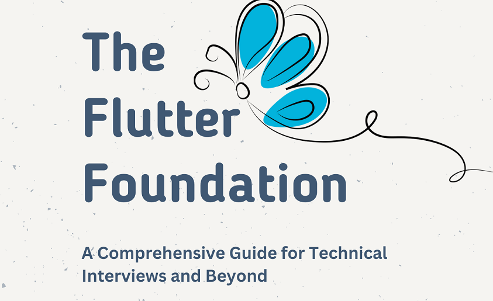

# The Flutter Foundation - A Comprehensive Guide for Technical Interviews and Beyond
Welcome to “The Flutter Foundation: A Comprehensive Guide for Technical Interviews and Beyond”! Whether you’re a seasoned developer looking to delve into the world of Flutter or a newcomer eager to master the latest in cross-platform app development, this book is your ultimate companion.

    

## Download Free @ https://chetanakarte.gumroad.com/l/the_flutter_foundation
Flutter has rapidly gained popularity as a powerful framework for building beautiful and performant mobile, web, and desktop applications. With its reactive UI, hot reload feature, and extensive widget library, Flutter offers developers the flexibility and productivity needed to create stunning user experiences across platforms.

In this book, we’ll take you on a journey through the fundamentals of Flutter, covering everything you need to know to ace technical interviews and excel as a Flutter developer. From basic concepts to advanced topics, each question is carefully crafted to provide a comprehensive understanding of Flutter development principles and best practices.

Don’t forgot to Buy me a Coffee if his book help you to get a Job by cracking your flutter interview.

## Here’s what you can expect to learn:

*  **Flutter Basics:** Get started with Flutter by learning about its architecture, widgets, layout system, and essential development tools.
  
*  **Building UIs:** Master the art of building beautiful and responsive user interfaces using Flutter’s widget library, layout widgets, and custom painting techniques.
  
*  **State Management:** Explore various state management techniques in Flutter, including setState, Provider, Bloc, Redux, and Riverpod, and learn how to choose the right approach for your app.
  
*  **Networking and Data Persistence:** Learn how to fetch data from remote APIs, handle network requests, and store data locally using packages like Dio, http, SQLite, Hive, and SharedPreferences.
  
*  **Navigation and Routing:** Navigate between screens, handle navigation transitions, pass data between routes, and implement deep linking and routing in your Flutter app.
  
*  **Testing and Debugging:** Master the art of testing Flutter apps using unit tests, widget tests, integration tests, and learn how to debug common issues using Flutter DevTools.
  
*  **Advanced Topics:** Dive into advanced topics such as animations, custom gestures, platform integration, internationalization, accessibility, and performance optimization.
  
*  **Interview Preparation:** Prepare for technical interviews by solving coding challenges, practicing common interview questions, and mastering key concepts and algorithms.
  
Whether you’re aiming to land your dream job as a Flutter developer, enhance your existing skills, or build innovative cross-platform applications, [“The Flutter Foundation”](https://chetanakarte.gumroad.com/l/the_flutter_foundation) equips you with the knowledge, tools, and confidence to succeed in today’s competitive tech industry.

Get ready to unleash your creativity, build exceptional Flutter apps, and embark on an exciting journey of learning and growth. Let’s dive in and master The Flutter Foundation together!

compiled and brought to you by…

**Chetankumar Akarte**

LinkedIn — https://www.linkedin.com/in/chetanakarte

# Flutter Technical Interviews Questions
*  **[How do you become a good Flutter Developer?](https://medium.com/@chetan.akarte/how-do-you-become-a-good-flutter-developer-234bae266f05)**

*  **[What is Flutter, and how does it differ from other mobile app development frameworks?](https://medium.com/@chetan.akarte/what-is-flutter-and-how-does-it-differ-from-other-mobile-app-development-frameworks-add5549aebe3)**

* **<a href="https://medium.com/@chetan.akarte/describe-flutters-architectural-overview-and-how-it-works-10fa85e99373" target="_blank">Describe Flutter’s architectural overview and how it works.</a>**

* **<a href="https://medium.com/@chetan.akarte/describe-the-advantages-of-using-flutter-for-cross-platform-app-development-df8cc4cec5ae" target="_blank">Describe the advantages of using Flutter for cross-platform app development. OR Why is Flutter preferred over other mobile app developing tools?</a>**

* **<a href="https://medium.com/@chetan.akarte/what-are-the-flutter-widgets-3704464f34c5" target="_blank">What are the Flutter widgets?</a>**

* **<a href="https://medium.com/@chetan.akarte/how-does-the-widget-tree-work-in-flutter-4bd8bfc85a88" target="_blank">How does the widget tree work in Flutter?</a>**

* **<a href="https://medium.com/@chetan.akarte/the-flutter-foundation-a-comprehensive-guide-for-technical-interviews-and-beyond-book-by-124b3539f02d" target="_blank">What is the Root widget and the Leaf widgets in Flutter?</a>**

* **<a href="https://medium.com/@chetan.akarte/what-is-the-difference-between-shallow-and-deep-widget-trees-and-when-would-you-use-each-d44e338bf401" target="_blank">What is the difference between “Shallow” and “Deep” widget trees, and when would you use each?</a>**

* **<a href="https://medium.com/@chetan.akarte/describe-different-types-of-widgets-available-in-flutter-c7a68ce6ceee" target="_blank">Describe different types of widgets available in Flutter</a>**

* **<a href="https://medium.com/@chetan.akarte/what-is-the-difference-between-stateless-and-stateful-widget-in-flutter-153b69b36d1a" target="_blank">What is the Difference Between Stateless and Stateful Widget in Flutter?</a>**

* **<a href="https://medium.com/@chetan.akarte/what-is-the-purpose-of-the-scaffold-widget-in-flutter-and-how-does-it-structure-app-layouts-6ce34547e32d" target="_blank">What is the purpose of the “Scaffold” widget in Flutter, and how does it structure app layouts?</a>**

* **<a href="https://medium.com/@chetan.akarte/what-are-layout-widgets-and-how-do-you-use-them-to-design-ui-in-flutter-bee4602bf50c" target="_blank">What are layout widgets, and how do you use them to design UI in Flutter?</a>**

* **<a href="https://medium.com/@chetan.akarte/what-is-the-lifecycle-of-a-stateful-widget-in-flutter-0adf00f50de9" target="_blank">What is the lifecycle of a stateful widget in flutter?</a>**

* **<a href="https://medium.com/@chetan.akarte/what-is-the-purpose-of-the-setstate-method-and-how-does-it-work-e3143dde6f84" target="_blank">What is the purpose of the setState method, and how does it work?</a>**

* **<a href="https://medium.com/@chetan.akarte/why-is-the-build-method-on-state-and-not-statefulwidget-73543443e64e" target="_blank">Why is the build method on State, and not StatefulWidget?</a>**

* **<a href="https://medium.com/@chetan.akarte/what-is-the-use-of-pubspec-yaml-file-in-a-flutter-project-541c728bddef" target="_blank">What is the use of pubspec.yaml file in a flutter project?</a>**

* **<a href="https://medium.com/@chetan.akarte/what-are-dependencies-dev-dependencies-in-a-flutter-project-480d4877d719" target="_blank">What are dependencies & dev_dependencies in a flutter project? How they are different from each other?</a>**

* **<a href="https://medium.com/@chetan.akarte/what-is-the-difference-between-a-flutter-package-and-the-flutter-plugin-a5e8edf9e88b" target="_blank">What is the difference between a flutter package and the flutter plugin.</a>**

* **<a href="https://medium.com/@chetan.akarte/what-is-the-difference-between-flutter-widgetsapp-and-materialapp-01433ab82d0e" target="_blank">What is the difference between flutter WidgetsApp and MaterialApp?</a>**

* **<a href="https://medium.com/@chetan.akarte/what-is-the-difference-between-flutter-material-widget-and-cupertino-widget-890a579e1bbf" target="_blank">What is the difference between flutter Material Widget and Cupertino Widget?</a>**

* **<a href="https://medium.com/@chetan.akarte/what-is-the-difference-between-hot-reload-and-hot-restart-in-flutter-a248760761e3" target="_blank">What is the difference between hot reload and hot restart in flutter?</a>**

* **<a href="https://medium.com/@chetan.akarte/how-do-you-reduce-widget-rebuild-in-flutter-dc558958339a" target="_blank">How do you reduce widget rebuild in flutter?</a>**

* **<a href="https://medium.com/@chetan.akarte/explain-the-tree-shaking-mechanism-in-flutter-f7048070caf1" target="_blank">Explain the “Tree shaking” Mechanism in Flutter</a>**

* **<a href="https://medium.com/@chetan.akarte/what-is-buildcontext-and-how-is-it-useful-in-a-flutter-application-c83cd41bb5bc" target="_blank">What is BuildContext and how is it useful in a flutter application? OR What are contexts in flutter?</a>**

  
